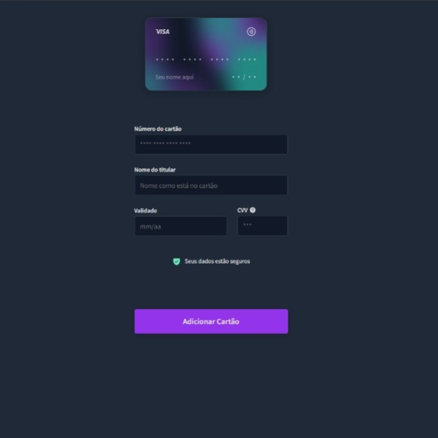

<h1 align="center"> Card Forms </h1>

Projeto gratuito #boracodar promovido pela Rocketseat onde toda semana eles fazem um desafio para os alunos se desafiarem sozinhos codando o que foi proposto. 

  

 

  

## 🚀 Tecnologias

Esse projeto foi desenvolvido com as seguintes tecnologias:

- HTML e CSS
- Git e Github
- Figma

## 💻 Projeto

Criamos um Card Forms onde você faz o flip do cartão ao passar o mouse ou clicar em c.

- [Acesse o projeto finalizado, online](https://github.com/raFaL02/card-forms)

## 🔖 Layout

Você pode visualizar o layout do projeto através [DESSE LINK](https://www.figma.com/file/BImyzr1v4RbJ0FASwe8bre/%23boraCodar---Desafio-13-(Community)?node-id=34%3A413&t=HmjsVrhGShkPAoC7-1). É necessário ter conta no [Figma](https://figma.com) para acessá-lo.

## :memo: Licença

Esse projeto está sob a licença MIT.

---

Feito com ♥ by Rocketseat :wave: [Participe da nossa comunidade!](https://discord.gg/rocketseat)